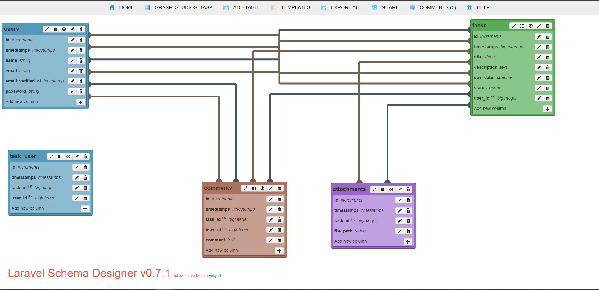
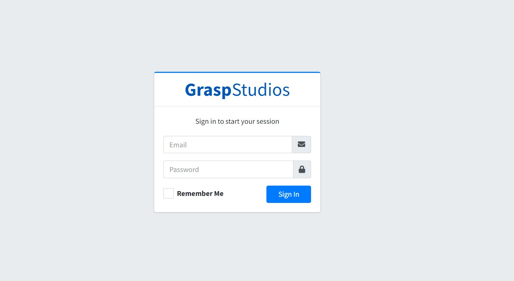
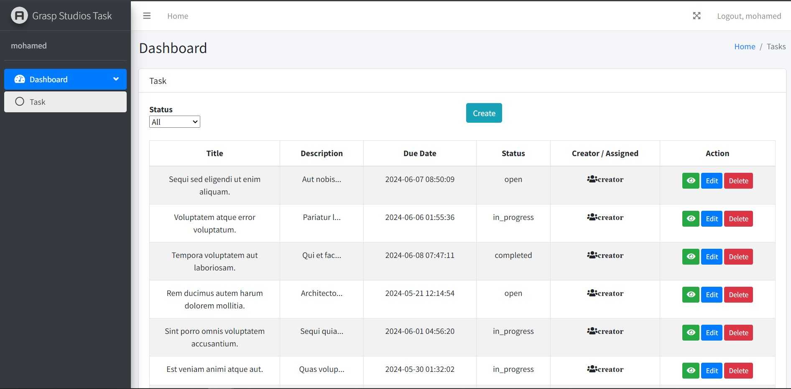

## Graspstudios Task

<p align="center">
    <p>
        Make ERD at <a href="https://laravelsd.com/">laravel SD</a>
    </p>
    
</p>


## How could you install and make a project working After Clone
update .env file your database name and it's your own credentials

first make sure to install the composer requirements
```php
composer install
```

second run the migrations this application
```php
php artisan migrate
```

third run seeder this step will generate four users and 100 tasks per user random except one user we will use for login the application

```php
php artisan db:seed
```
the credentials of the user to login
```php
email => "mohamed@graspstudios.co"
Password => "123456"
```
<p>
    run the project and you will found the following screen 
    
</p>

<p>
    after login we will see the form of list tasks and it's own CRUD  
    
</p>

## References

[Laravel SD](https://laravelsd.com/),
[Laravel Framework](https://laravel.com/),
[Admin LTE](https://adminlte.io/).
